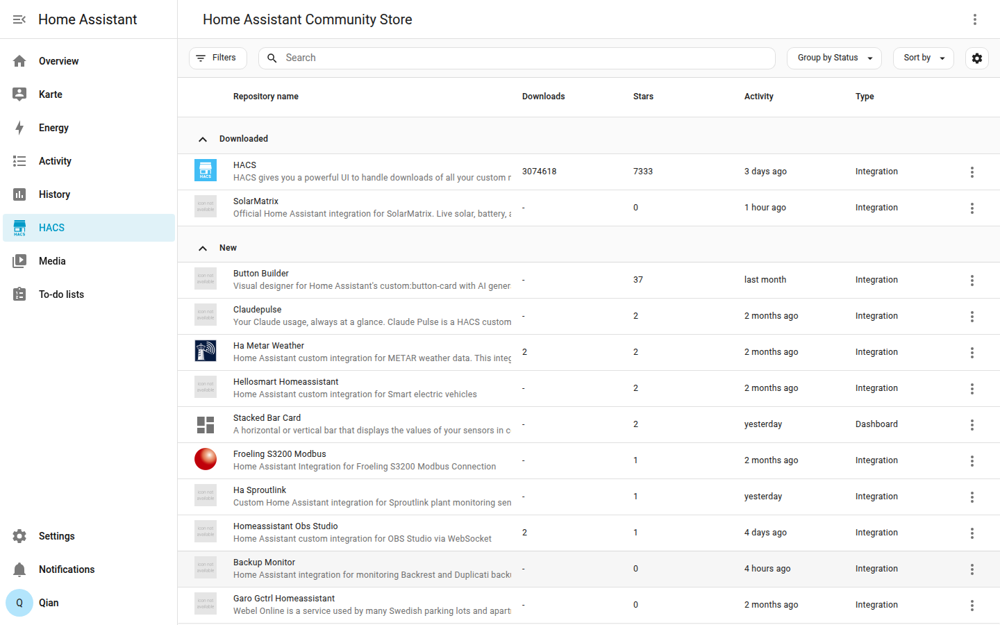
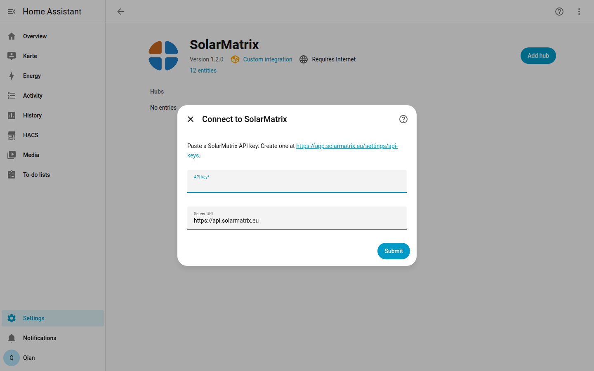
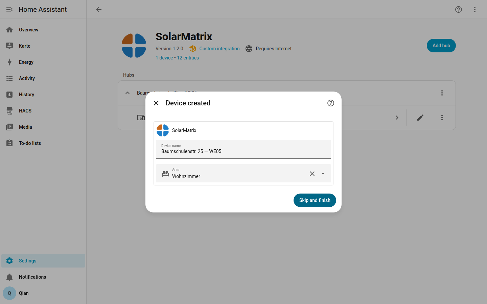
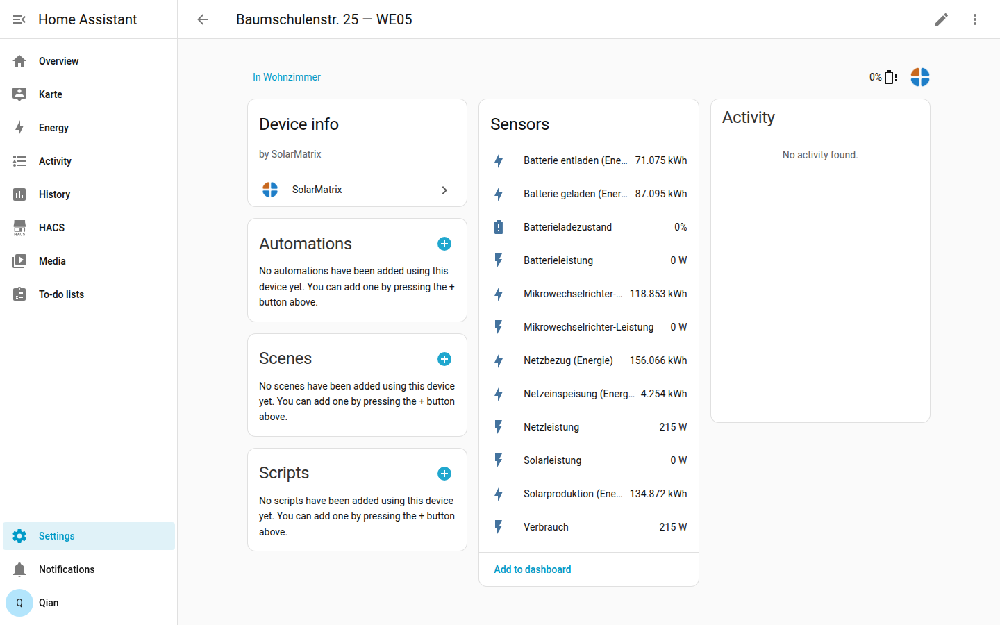
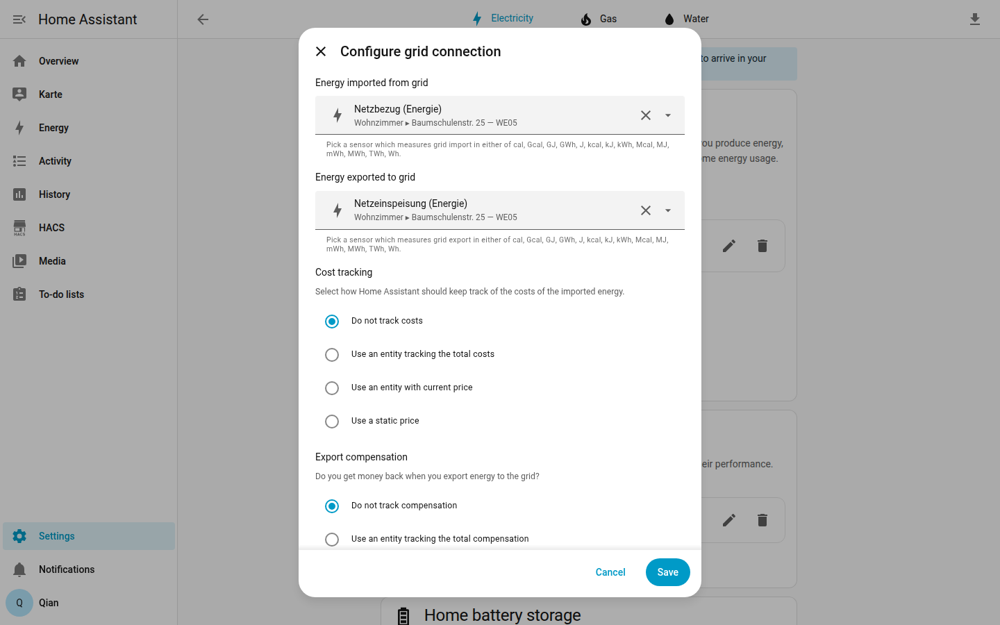
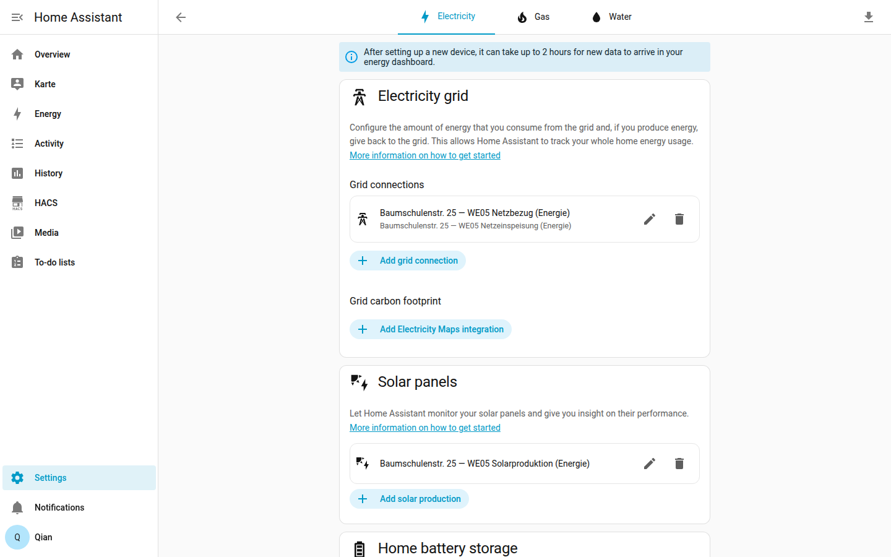
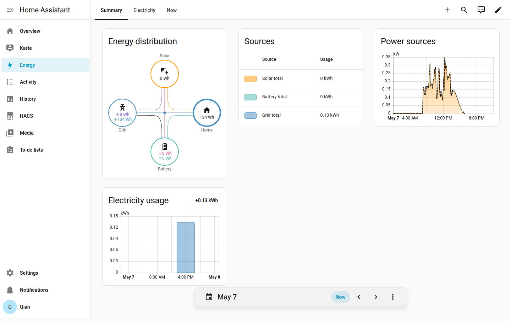

# SolarMatrix Home Assistant Integration

Live energy data from a SolarMatrix system, surfaced as Home Assistant
sensors and ready for the Energy Dashboard.

The integration polls the cloud API every 5 seconds over a single
keep-alive connection and exposes twelve sensors per configured household:

| Entity | Unit |
|---|---|
| Solar power | W |
| Microinverter output | W |
| Grid power (signed: + import, − export) | W |
| Battery power (signed: + charging, − discharging) | W |
| Battery state of charge | % |
| Consumption (microinverter + grid) | W |
| Solar production energy | kWh |
| Microinverter output energy | kWh |
| Grid import energy | kWh |
| Grid export energy | kWh |
| Battery charge energy | kWh |
| Battery discharge energy | kWh |

The six kWh sensors are real lifetime counters maintained server-side
(`state_class: total_increasing`). Numbers match the SolarMatrix portal
exactly. No Riemann helpers needed.

---

## Install

### 1. Get an API key

Open <https://app.solarmatrix.eu/settings/api-keys> and create a key.
Each key counts toward the per-account limit; use a fresh one if you
plan to add the integration to a second Home Assistant install.

### 2. Add this repository to HACS

In Home Assistant: **HACS → ⋮ (top-right) → Custom repositories →
Add**. Use:

- Repository: `https://github.com/solarmx/home-assistant-solarmatrix`
- Category: **Integration**

### 3. Install SolarMatrix from HACS

Find **SolarMatrix** in the HACS list and click **Download**. After it
finishes, restart Home Assistant when prompted.

### 4. Add the integration

**Settings → Devices & Services → Add Integration → SolarMatrix.**

Paste the API key from step 1. Submit. (Server URL only appears if you
have HA Advanced Mode enabled — leave it on the default
`https://api.solarmatrix.eu` unless you've been told otherwise.)

### 5. Done

If your account has one household, the integration creates the device
straight away. If you have multiple households, pick one — add the
integration again per household.

A device appears under SolarMatrix with twelve sensors. Live values
populate within a few seconds; the kWh counters reflect lifetime totals
already.

---

## Energy Dashboard

The six kWh sensors plug straight into Home Assistant's Energy
Dashboard wizard.

**Settings → Dashboards → Energy → Electricity tab.**

### Electricity grid

Click **Add grid connection** (or **Edit** if one exists). The wizard
auto-suggests the right sensors:

- *Energy imported from grid* → **Grid import energy**
- *Energy exported to grid* → **Grid export energy**

Save.

### Solar panels

**Add solar production** → pick **Solar production energy**. Save.

### Home battery storage

**Add battery system**:

- *Energy going in to the battery* → **Battery charge energy**
- *Energy coming out of the battery* → **Battery discharge energy**

Save.

### Final state

All three sections wired:

Open the **Energy** dashboard from the sidebar. Tiles populate as soon
as data flows; full history backfills from the integration's lifetime
counters.

Home Assistant derives the **Home consumption** tile automatically from
solar + grid + battery flows — no extra setup needed.
